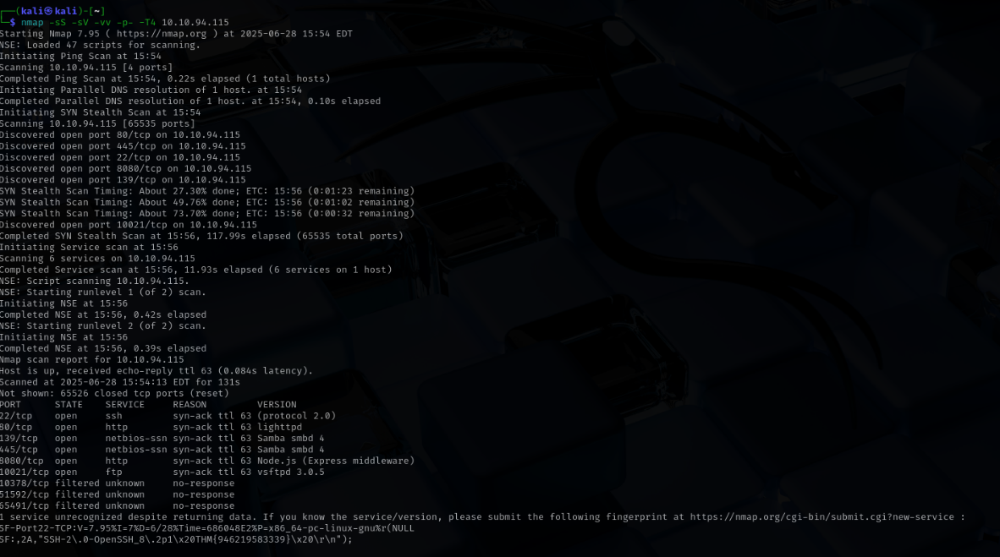
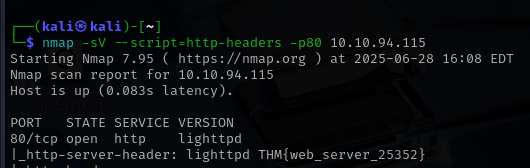
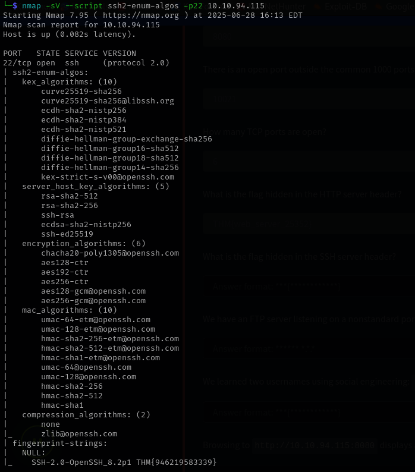
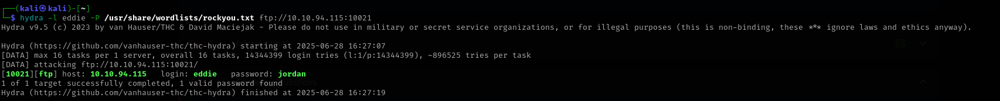
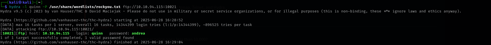

# NetSec-lab
Bu labda FTP brute force denemeleri ve belli başlı nmap komutları ile port taramaları yaptım.

Kullanılan araçlar: nmap, hydra

Tarama yapmam gereken IP adresi : 10.10.94.115

İlk başta nmap scani ile bir port taraması gerçekleştirmem gerek. Bu scande kullanacağım nmap komutları -sV, -sS, -vv, -p-, -T4 komutları olacak.

-sV : Kullanma nedenim sorulan soruların bazılarında bizden kullanılan servislerin versiyonları sorulmuş. 
-sS : Daha sessiz ve hızlı bir tarama için bu komutu kullandım.
-vv : Tarama esnasında detaylı çıktı görmek için kullandım.
-p- : Bİze sorulan soruların birinde 10.000'den fazla açık bir port olduğu söyleniyor. Bu yüzden bu komutu kullanma kararı verdim.
-T4 : Taramayı biraz hızlandırmak amaçlı kullandım. 

NMAP tarama sonuçlarım fotoğrafda görüldüğü gibi çıktı

Bu fotoğraftan soruların bazılarını cevaplayabiliriz.

İlk sorunun cevabı: 8080

İkinci sorunun cevabı: 10021 

Üçüncü sorunun cevabı: 6

Dördüncü soruda bize çalışan http servisinin headerı sorulmuş. Bunun için yine nmapten yararlanıcaz.

Bu sefer bize ssh server headerı sorulmuş. 

Fotoğrafın en sonunda SSH-2.0 iel başlayan satır bizim 5. sorumuzun cevabı olucak.

Altıncı sorunun cevabı ilk yaptığımız taramada mevcut. Cevabı ise vsftpd 3.0.5

Geriye kalan son iki soruyu çözmemiz için hydranın belli başlı komutlarını bilmemiz lazım. İki adet isim sosyal mühendislik ile ele geçirildiği belirtilmiş. Bu isimleri hydra ile deneyerek ftp serverine brute force uygulayacağız.
İlk isim için kullanacağım komut alttaki fotoğraftaki gibi olucak.

eddie için şifreyi bu şekilde bulmuş olduk. Şimdi aynısını quinn için deneyelim.

Böylece quinn için de şifreyi bulmuş olduk. Şimdi ftp serverına bu bulduğum şifreler ile bağlanalım.

eddie hesabı için: 

[FTP1](fotolar/foto6.png)

İstediğimiz flag burda çıkmadı. Diğer hesap ile deneyelim.

[FTP2](fotolar/foto8.png)

Flagimizi bulduk. Şimdi flagimizi makinemize indirelim.

[Flag](fotolar/foto9.png)

Şimdi cat komutunu kullanarak flagimizi okuyalım.

[CAT](fotolar/foto10.png)

Sonuncu soru bizden -sN taraması yapmamız için konulmuş. -sN taraması, Nmap'in ping scan yöntemidir ve portlara TCP bayrağı olmayan boş paketler göndererek hedefin açık mı kapalı mı olduğunu anlamaya çalışır. 
[-sN](fotolar/foto11.png)
[-sN2](fotolar/foto12.png)

